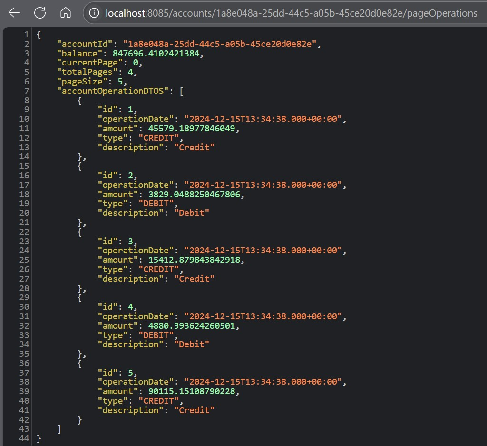

<h1>Projet JEE - Digital banking</h1>

Une application de gestion de comptes bancaires où chaque client possède des comptes (courants ou épargnes) pouvant enregistrer des opérations de débit et crédit.

<h2>Base de données MySQL</h2>

<h2>Gestion des comptes bancaires</h2>
<h3>Affichage de la liste de tous les comptes bancaires</h3>

<h3>Affichage de la liste de tous les comptes bancaires au niveau de Swagger</h3>

<h3>Affichage d'un compte bancaire par son ID</h3>

<h3>Affichage d'un compte bancaire par son ID au niveau de Swagger</h3>

<h3>Affichage des opérations d'un compte bancaire d'après son ID</h3>

<h3>Affichage des opérations d'un compte bancaire d'après son ID au niveau de Swagger</h3>

<h3>Affichage de la page des opérations d'un compte bancaire d'après son ID</h3>

<h3>Affichage de la page des opérations d'un compte bancaire d'après son ID au niveau de Swagger</h3>

<h3>Récupération paginée des opérations d'un compte bancaire d'après son ID</h3>

<h3>Récupération paginée des opérations d'un compte bancaire d'après son ID au niveau de Swagger</h3>

<h2>Gestion des clients</h2>
<h3>Affichage de la liste des clients</h3>

<h3>Affichage de la liste des clients au niveau de Swagger</h3>

<h3>Affichage d'un client par son ID</h3>

<h3>Affichage d'un client par son ID au niveau de Swagger</h3>

<h3>Ajout d'un client</h3>

<h3>Liste des clients avant la suppression</h3>

<h3>Suppression d'un client</h3>

<h2>Modification d'un client</h2>
<h3>Avant la modification</h3>

<h3>Après la modification</h3>

